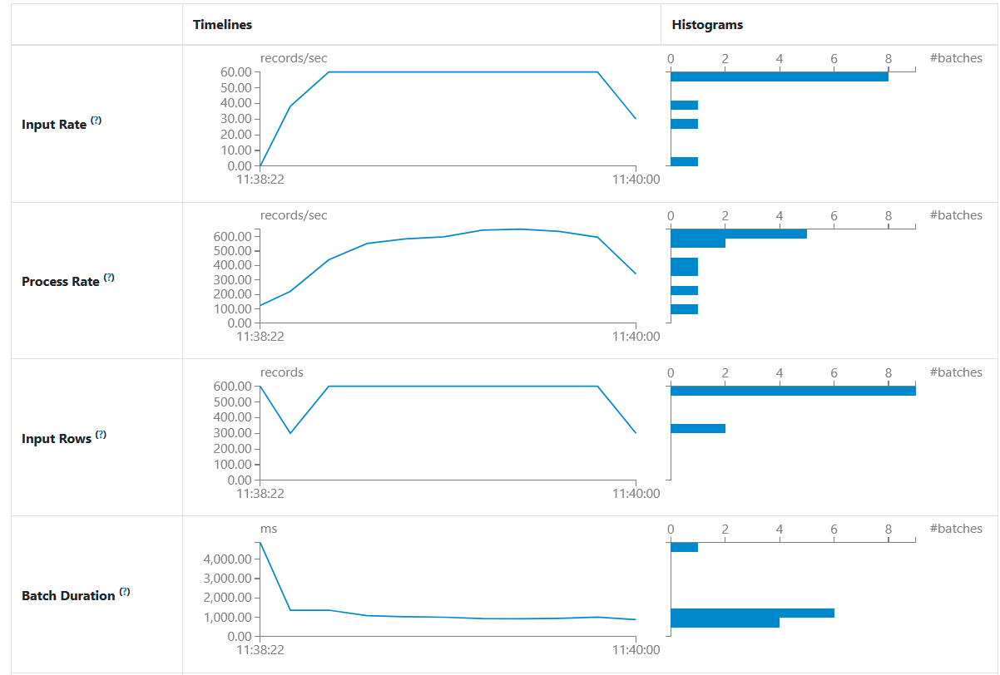
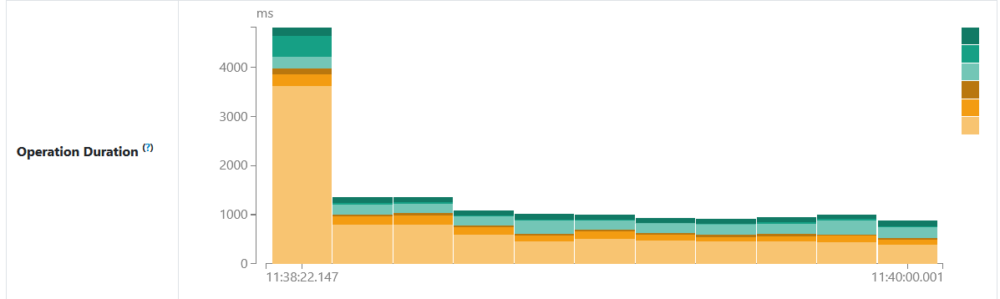

# Performance Metrics Report

**Real-Time E-commerce Events Pipeline**
Apache Spark Structured Streaming → PostgreSQL

---

## 1. Introduction

This report presents a performance evaluation of a real-time data ingestion pipeline developed to simulate e-commerce user activity tracking. The system continuously ingests CSV-based event data, processes it using Apache Spark Structured Streaming, and persists the transformed records into a PostgreSQL database.

Performance metrics were collected from the following verified sources:

* Apache Spark Structured Streaming Web UI
* Spark execution logs
* Docker container runtime statistics (`docker stats`)

The evaluation focuses on **throughput**, **latency**, **resource utilization**, and **streaming stability** under continuous execution.

---

## 2. Test Environment

* **Execution Environment**: Local machine using Docker containers
* **Spark Deployment Mode**: Local mode
* **Streaming Source**: File-based streaming (CSV files written continuously to a directory)
* **Streaming Sink**: PostgreSQL database (`events` table)
* **Streaming Trigger Interval**: 10 seconds
* **Test Duration**: Approximately 2 minutes
* **Total Records Observed (Spark UI)**: ~6,000 records
* **Measurement Date**: January 13, 2026

---

## 3. Data Generation Characteristics

* Event data is generated by a Python-based data generator
* Data is written as CSV files into a directory monitored by Spark
* Each generated file contains approximately **100 records**
* Files are generated at fixed intervals to simulate real-time ingestion

This controlled and repeatable generation pattern produces a stable input stream suitable for performance measurement.

---

## 4. Throughput Analysis

### 4.1 Input Throughput (Spark Ingestion Rate)

**Observed from Spark UI and execution logs:**

* **Average input rate**: 55–60 records per second
* **Peak input rate**: 60 records per second
* **Records per micro-batch**: ~600 records

**Interpretation**

The input rate remains stable throughout execution. Spark reliably detects and ingests new files without delay or backlog. Input rate decreases only when data generation stops, confirming graceful stream completion.

---

### 4.2 Processing Throughput (Spark Processing Rate)

**Observed from Spark UI:**

* **Average processing rate**: 550–600 records per second
* **Processing-to-input ratio**: ~10:1

**Interpretation**

Spark processes incoming data significantly faster than it arrives. This confirms that the pipeline is not constrained by CPU, disk, or network resources under the tested workload.

---

### 4.3 End-to-End Throughput Comparison

| Pipeline Stage   | Throughput (records/sec) |
| ---------------- | ------------------------ |
| Data Generation  | 10–20                    |
| Spark Input Rate | 55–60                    |
| Spark Processing | 550–600                  |

**Conclusion**

The processing capacity of Spark far exceeds the ingestion rate, ensuring continuous real-time processing without backlog accumulation.

---

## 5. Latency Analysis

### 5.1 Batch Processing Latency

**Observed from Spark UI (Batch Duration graph):**

* **Initial batch duration**: ~4.5 seconds
* **Steady-state batch duration**: ~0.8–1.2 seconds

**Interpretation**

The first micro-batch experiences higher latency due to Spark job initialization and file discovery. After initialization, batch execution stabilizes with consistently low latency.

---

### 5.2 End-to-End Latency

**Measured components:**

* Streaming trigger interval: 10 seconds
* Batch processing time: ~1 second

**Observed end-to-end latency:**
**10–20 seconds**

**Interpretation**

The trigger interval is the dominant contributor to end-to-end latency. Processing completes well within the trigger window, resulting in predictable latency behavior.

---

## 6. Resource Utilization (Docker Runtime Metrics)

Resource usage was measured during steady-state execution using `docker stats`.

---

### 6.1 CPU Utilization

| Container       | CPU Usage    |
| --------------- | ------------ |
| Spark Streaming | 0.3% – 1.1%  |
| PostgreSQL      | 0.0% – 0.03% |

**Observation**

CPU utilization remains consistently low for all containers, indicating that the workload is not CPU-bound.

---

### 6.2 Memory Utilization

| Container       | Memory Usage |
| --------------- | ------------ |
| Spark Streaming | ~824 MB      |
| PostgreSQL      | ~25 MB       |

**Observation**

Spark consumes more memory due to in-memory processing and streaming execution. PostgreSQL memory usage remains minimal during batch inserts.

---

### 6.3 Network I/O

| Container       | Network In | Network Out |
| --------------- | ---------- | ----------- |
| Spark Streaming | ~13.4 MB   | ~636 KB     |
| PostgreSQL      | ~389 KB    | ~152 KB     |

**Observation**

Network traffic remains moderate and consistent with local container-to-container communication.

---

### 6.4 Disk I/O

* PostgreSQL shows higher disk write activity due to persistent storage of streaming results
* CSV file reads by Spark are lightweight and fast
* No disk contention or I/O bottlenecks were observed

---

## 7. Streaming Stability and Reliability

**Observed during execution:**

* No skipped micro-batches
* No backlog accumulation
* No failed batches
* Scheduling delay consistently near zero

**Conclusion**

The streaming pipeline maintains stable and reliable execution throughout the test duration.

---

## 8. Spark UI Visual Metrics

The following figures were captured directly from the Spark Structured Streaming Web UI during execution:

**Figure 1 & 2:** Spark Structured Streaming performance metrics showing input rate, processing rate, batch duration, and operation execution time.

---

## 9. Overall Performance Evaluation

Based on Spark UI metrics, execution logs, and Docker runtime statistics, the system demonstrates:

* High processing throughput relative to ingestion rate
* Low and consistent latency after initialization
* Efficient CPU and memory utilization
* Stable and reliable continuous streaming behavior

---

## 10. Final Conclusion

The real-time e-commerce events pipeline implemented using Apache Spark Structured Streaming and PostgreSQL performs efficiently under continuous load. The system processes data significantly faster than it is generated, maintains predictable latency characteristics, and utilizes system resources conservatively.

These results confirm that the implemented architecture is suitable for real-time and near-real-time analytics workloads and can support increased data volumes with appropriate scaling and configuration.

