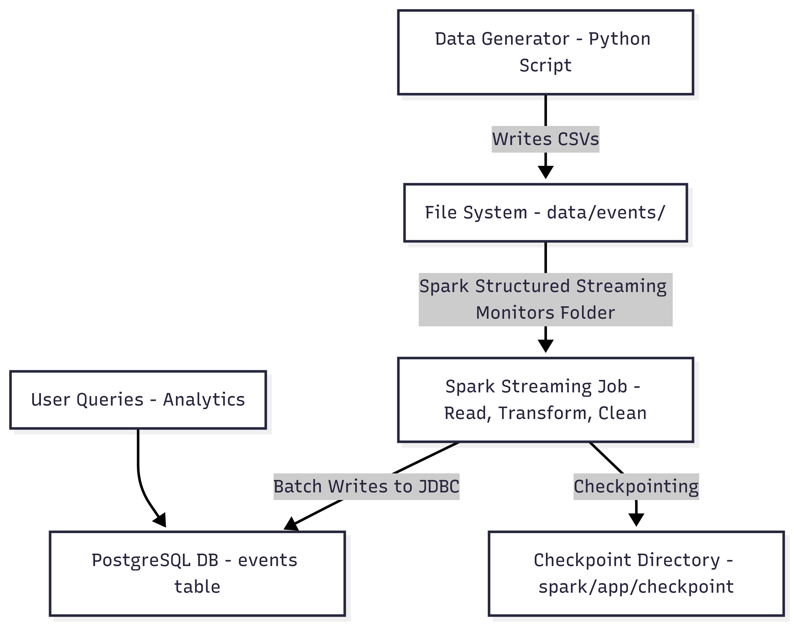

# Project Overview

## Real-Time E-Commerce Data Ingestion Pipeline

This project implements a **real-time data ingestion and processing pipeline** that simulates user activity on an e-commerce platform. It demonstrates how streaming data can be generated, processed, cleaned, and stored using **Apache Spark Structured Streaming** and **PostgreSQL**, all orchestrated with **Docker and Docker Compose**.

The project was implemented as part of a data engineering learning exercise, with emphasis on real-world pipeline structure, fault tolerance, and data quality handling.

---

## Project Objectives

- Simulate real-time user activity data for an e-commerce system  
- Process streaming data using Spark Structured Streaming  
- Apply data validation and transformation logic  
- Persist processed data into a relational database  
- Containerize the entire system for reproducibility and portability  

---

## Components and Workflow

### 1. Data Generation (Producer)

- Implemented in `src/data_generator.py`
- Simulates e-commerce user events such as:
  - `view`
  - `purchase`
- Generates CSV files in small batches at fixed time intervals
- Writes output to the `data/events/` directory
- Introduces realistic data behavior:
  - Randomized users and products
  - Optional/missing fields (e.g., `session_id`)
  - Timestamp generation for event-time processing

This approach mimics a real streaming source using a file-based system.

---

### 2. Streaming Processing (Spark Structured Streaming)

- Implemented in `src/spark_streaming_to_postgres.py`
- Uses Spark Structured Streaming to:
  - Continuously monitor the `data/events/` directory
  - Read newly arriving CSV files as a streaming source
- Applies real-world data transformations:
  - Timestamp parsing with multiple fallback formats
  - Data cleansing (null handling, trimming, value validation)
  - Standardization of action values
- Uses micro-batch processing for low-latency ingestion
- Configured with a checkpoint directory for fault tolerance and recovery

---

### 3. Data Storage (PostgreSQL)

- PostgreSQL serves as the sink for processed streaming data
- Database schema and indexes are created via:
  - `sql/postgres_setup.sql`
- Stores all cleaned and validated events in the `events` table
- Indexes are applied on commonly queried columns (e.g., timestamp, user_id, action) to improve query performance

---

### 4. Containerization and Orchestration

- Docker is used to containerize:
  - Spark application
  - PostgreSQL database
- Docker Compose orchestrates the multi-container setup:
  - Ensures service startup order
  - Manages shared volumes for data and logs
- A startup script runs:
  - SQL initialization
  - Data generator
  - Spark streaming job in parallel
- Environment variables are used for configuration, improving security and flexibility

---

## System Architecture

This architecture follows a common real-time data engineering pattern:
**Producer > Streaming Processor >  Persistent Storage**

---

## Key Features Implemented

- Real-time file-based streaming simulation
- Structured Streaming with checkpointing
- JDBC integration between Spark and PostgreSQL
- Data quality checks and transformations
- Dockerized, reproducible development environment
- Clear project structure following data engineering best practices

---

## Performance Characteristics

- Micro-batch interval simulates near real-time ingestion
- Low memory usage due to small batch sizes
- Efficient writes to PostgreSQL using batch operations
- Designed to scale with increased data volume

---

## Learning Outcomes

Through this project, the student gained hands-on experience with:
- Spark Structured Streaming concepts
- Real-time data ingestion patterns
- JDBC-based database integration
- Docker and Docker Compose workflows

This project serves as a strong foundation for building more advanced streaming pipelines using message brokers such as Kafka and cloud-based data platforms.

